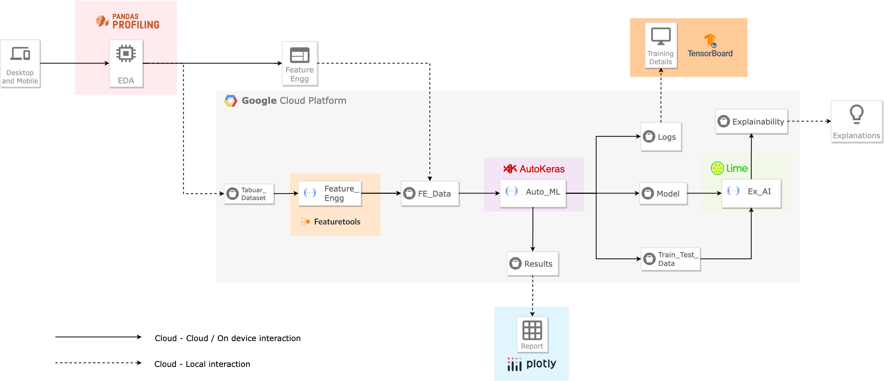
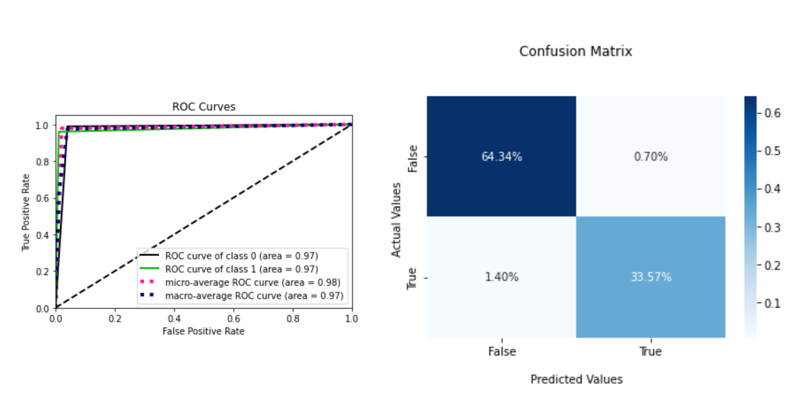
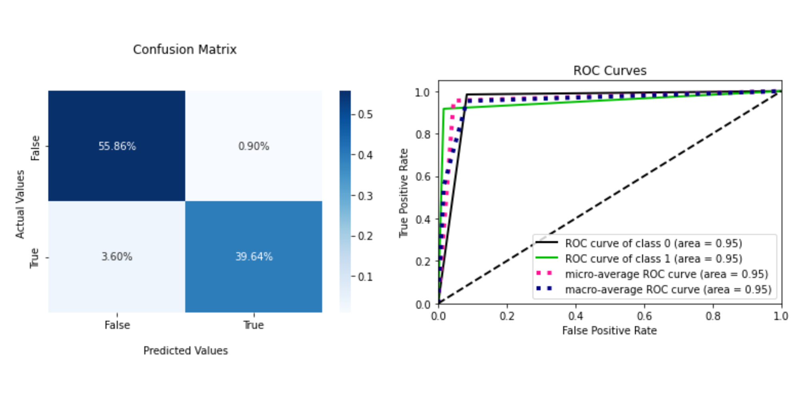
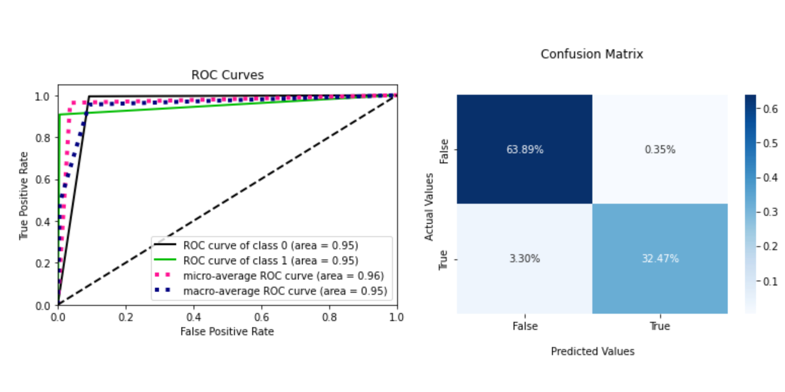
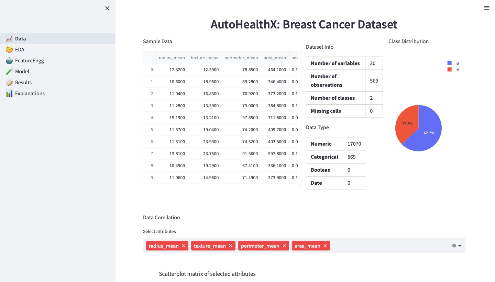
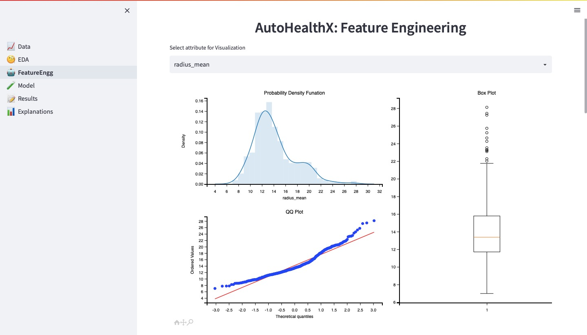
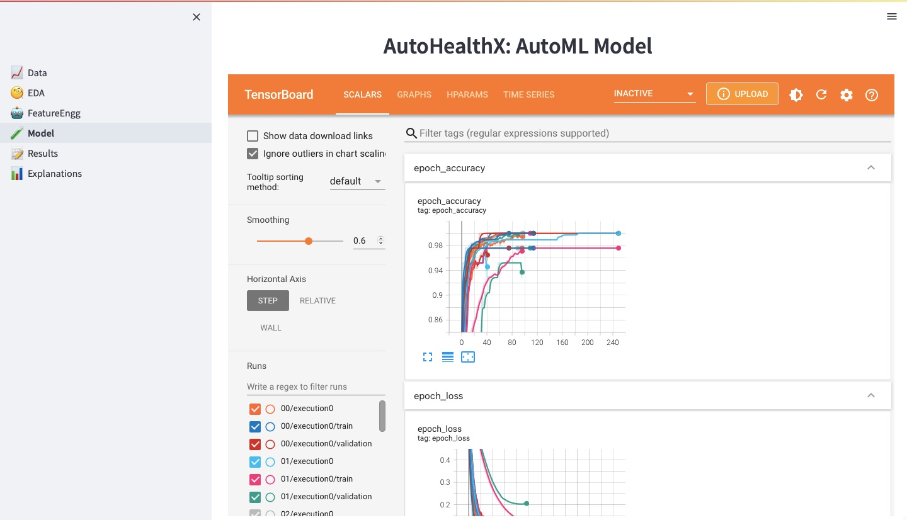
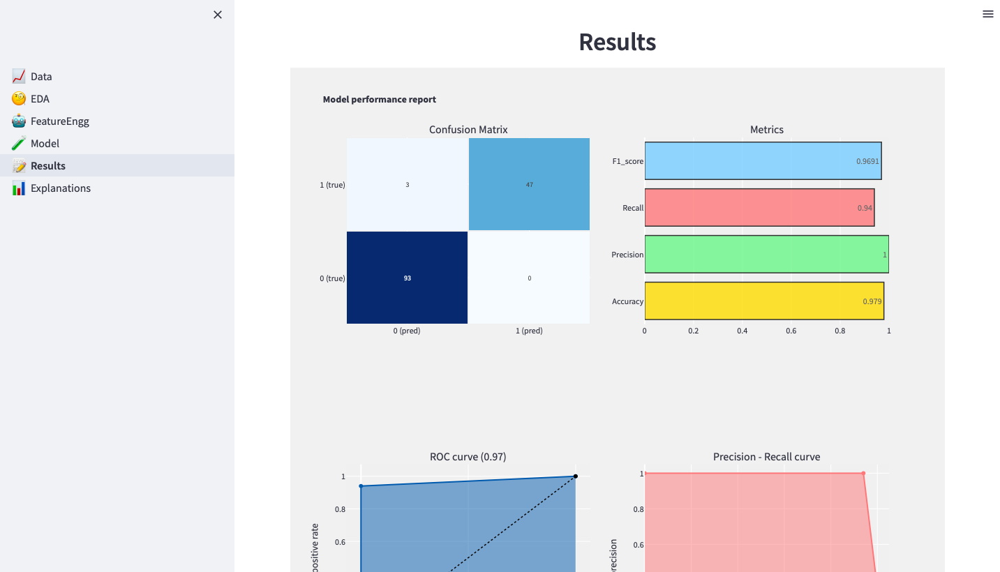

<h1> AI meets Cloud: One Framework, Many Application</h1>

[Abhimanyu Bhowmik](https://scholar.google.com/citations?user=r3bzJ7oAAAAJ&hl=en), [Madhushree Sannigrahi](https://scholar.google.com/citations?user=Mtnm7igAAAAJ&hl=en), [Deepraj Chowdhury](https://scholar.google.com/citations?user=9sZgeV4AAAAJ&hl=en), [Ajoy Dey](https://scholar.google.com/citations?hl=en&user=J0I2lyYAAAAJ), [Sukhpal Singh Gill](https://scholar.google.co.uk/citations?user=NHkWom4AAAAJ&hl=en)

 
 

 

> **Abstract:** *There is a significant gap between the AI and industries in the modern world. This is mostly due to the lack of resources and technical expertise. Therefore, our goal in this study is to build a bridge and open up AI to the non-tech population, particularly the healthcare industry. However, a significant barrier is that AI needs to be adaptable enough to operate in many contexts with various datasets. To do this, we propose a serverless AutoML model with explainable AI. A user-friendly interface for non-professionals has also been created using an interactive web application. Any non-technical user may run the full model, which has a 98 \% accuracy rate. The suggested application aims to unlock the immense potential of AI across various fields, starting with healthcare.*

  

<h2>Dataset</h2>

Firstly, the “Breast Cancer Wisconsin (Diagnostic) Data Set” by “UCI ML Repository” is implemented on the novel methodology for the paper \cite{1st}. The dataset contains tabular data with 32 features and over 569 data points. A fine needle aspirate (FNA) of a breast lump is used to generate the features from a digital image in 3-dimensional space as described by Bannett et al. \cite{bennett1992robust}. They characterise the properties of all the observable cell nuclei in the image. Every data point is classified into either Benign(B) or Malignant(M) class.

Secondly, the architecture is applied to the “Heart Disease Cleveland dataset” Dataset by “UCI ML Repository” \cite{second}. The dataset constitutes over 300 patients’ data with 75 attributes, However, only 14 of the feature are taken into consideration for determining whether a patient has heart disease or not. 

Thirdly, the “Diabetes dataset”, originally from the National Institute of Diabetes and Digestive and Kidney Diseases, is used in this paper \cite{third}. The goal is to determine if a patient has diabetes based on diagnostic parameters. The implemented Diabetes dataset is a subset of an enormous dataset with 10 attributes and 768 instances. All patients are Pima Indian females who are at least 21 years old.

<h2>Proposed Methodology</h2>

  

Overall view of the proposed model: AutohelathX 

 

<h2>Results </h2>
<h3>Case I: Breast Cancer Wisconsin Diagnosis</h3>

ROC-AUC curve and Confusion Matrix 75:25 train-validation ratio

<h3>Case II: Heart Disease Cleveland Dataset</h3>

ROC-AUC curve and Confusion Matrix 75:25 train-validation ratio

  

<h3>Case III: Diabetes Dataset</h3>

ROC-AUC curve and Confusion Matrix 75:25 train-validation ratio

  

<h3>Case IV: COVID-19 Dataset</h3>

ROC-AUC curve and Confusion Matrix 75:25 train-validation ratio

  

<h2>AutohealthX Application</h2>
 

<h3>The Dataset page with Breast Cancer Dataset</h3>

 

<h3>The EDA page with Breast Cancer Dataset</h3>

  

<h3>The Feature Engineering page with Breast Cancer Dataset</h3>

  

<h3>The Model page with Breast Cancer Dataset</h3>

  

<h3>The Results page with Breast Cancer Dataset</h3>

  

<h3>The LIME Explainer page with Breast Cancer Dataset</h3>

  

<h2>Cite our work</h2>

    
    Bhowmik A., Sannigrahi M., Chowdhury D., Dey A. (2023) AutoHealthX: Automated machine learning and Explainable AI
    based Cloud functions for Healthcare (Prepriint).

<h2>Contact</h2>
For any queries, please contact: <a href="mailto:bhowmikabhimnayu@gmail.com">bhowmikabhimnayu@gmail.com</a>

