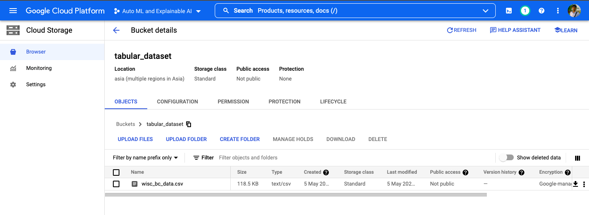
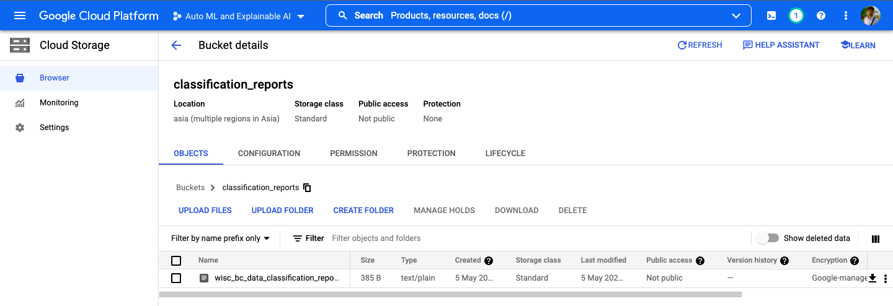
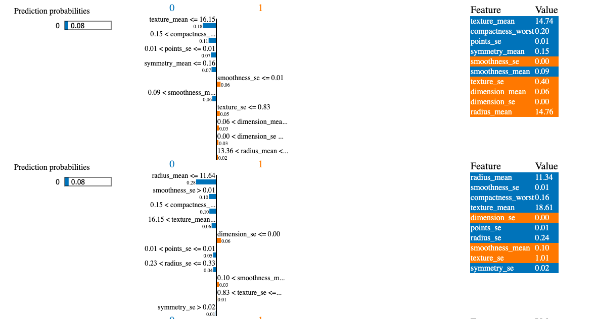

# Auto ML and Explainable AI using Serverless Functions

Research oriented, open source, Cloud Native solution using serverless cloud function to generate auto ml models and interpret results using Explainable AI solutions.

Google Cloud Functions (1st Gen) is selected as a serverless solution to build out experimental architecture. Using cloud functions in python 3.9 runtimes the proposed experiment was conducted. The memory requirements time out of the runtime environment is set up according to the particular function’s workload.

Google Cloud Storage is used for storing the data and their respective output. Cloud Storage events are used as triggers to the respective cloud functions.

### Proposed solution:

In the proposed architecture 2 subsequent cloud functions are used for generating the auto ml model, predicting the results and explaining the predicted results. For the auto ml model, open-source autokeras python library is used, and Lime library is used for explaining the model. To explain the global decision boundary of the model over a sample set of observations SP-Lime (Submodular Pick Locally Interpretable Model-Agnostic Explanations) is used instead of vanilla Lime explanations. 

Upload dataset into Cloud Storage:

### * Function 1:

The first cloud function is triggered when the clean data is uploaded to the specific bucket, it will generate 5 different models from the training data (70% of given data) and train them up to 100 epochs, the best performer in-termes of accuracy will be chosen for the particular dataset. The selected model will be checked on the test data (30% of given data) and the performance matrices ( Confusion Matrix, Classification Report ) will be generated, All the training and testing data along with performance matrices and the model itself will be exported in specific cloud buckets. The model is exported in .h5 format, which is TensorFlow Keras standard format for exporting ML models. 

Generating AutoML Model :

Getting Results:

### * Function 2:

The second cloud function acts when the model is generated and uploaded in its particular cloud storage, it receives the model along with the training and testing data. The function generates SP-Lime explanations. For generating the explanations a random 20 test data samples were chosen, among them 5 results were generated. The resulting graphs were merged into a single HTML file and uploaded to a cloud storage bucket. Data upload, and prediction as well as explanations can be retrieve by any client-side web/mobile application using google cloud SDK.

Generating Explanations of model:

