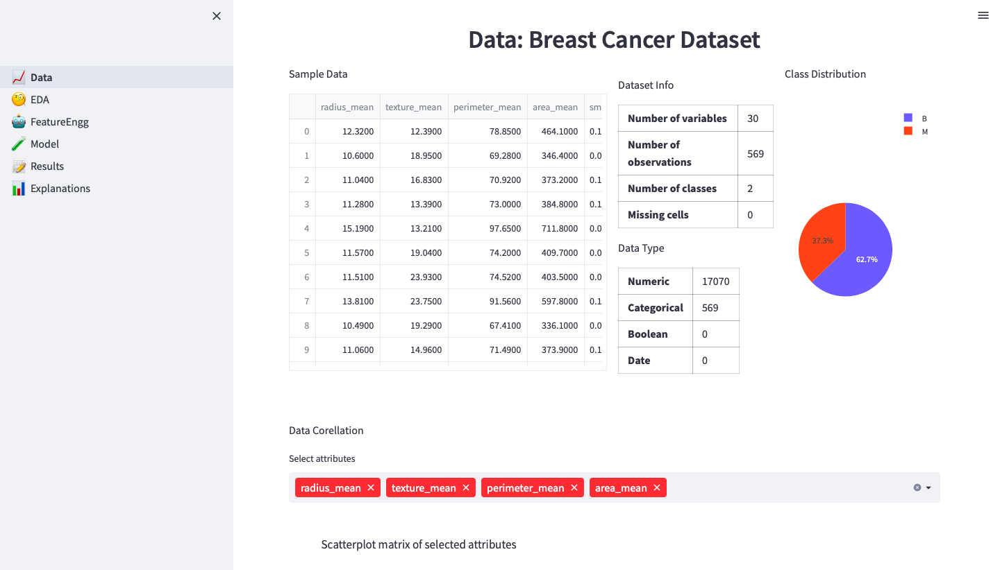
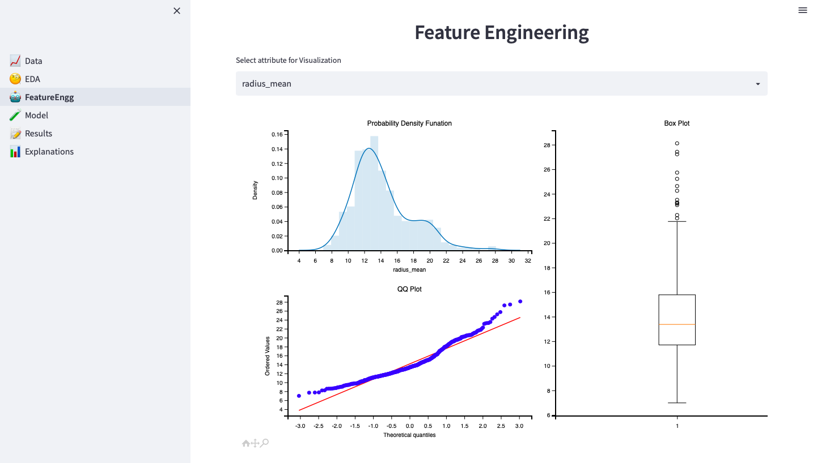
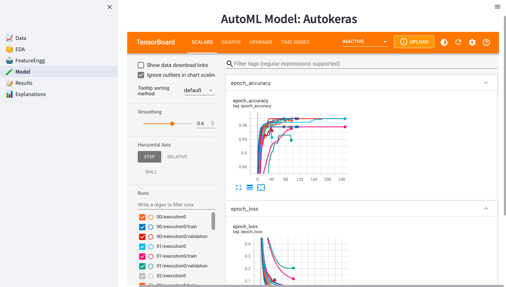

<h1>CloudAISim: A toolkit for modelling and simulation of modern applications in AI-driven cloud computing environments</h1>

[Abhimanyu Bhowmik](https://scholar.google.com/citations?user=r3bzJ7oAAAAJ&hl=en), [Madhushree Sannigrahi](https://scholar.google.com/citations?user=Mtnm7igAAAAJ&hl=en), [Deepraj Chowdhury](https://scholar.google.com/citations?user=9sZgeV4AAAAJ&hl=en), [Ajoy Dey](https://scholar.google.com/citations?hl=en&user=J0I2lyYAAAAJ), [Sukhpal Singh Gill](https://scholar.google.co.uk/citations?user=NHkWom4AAAAJ&hl=en)

[](https://github.com/abhimanyubhowmik/AutoHealthX/blob/main/Report/Minor_Project.pdf) 
[](https://www.kaggle.com/datasets/uciml/breast-cancer-wisconsin-data) 
[](https://github.com/abhimanyubhowmik/AutoHealthX/tree/main/App/models)
[](https://docs.google.com/presentation/d/1btUACelHTbZ4aX9lCH3yg1O-jxsZWn4l/edit?usp=sharing&ouid=103859519837437819731&rtpof=true&sd=true) 

> **Abstract:** *There is a very significant knowledge gap between Artificial Intelligence (AI) and a multitude of industries that exist in today’s modern world. This is primarily attributable to the limited availability of resources and technical expertise. However, a major obstacle is that AI needs to be flexible enough to work in many different applications, utilising a wide variety of datasets through cloud computing. As a result, we developed a benchmark toolkit called CloudAISim to make use of the power of AI and cloud computing in order to satisfy the requirements of modern applications. The goal of this study is to come up with a strategy for building a bridge so that AI can be utilised in order to assist those who are not very knowledgeable about technological advancements. In addition, we modelled a healthcare application as a case study in order to verify the scientific reliability of the CloudAISim toolkit and simulated it in a cloud computing environment using Google Cloud Functions to increase its real-time efficiency. A non-expert-friendly interface built with an interactive web app has also been developed. Any user without any technical knowledge can operate the entire model, which has a 98% accuracy rate. The proposed use case is designed to put AI to work in the healthcare industry, but CloudAISim would be useful and adaptable for other applications in the future.*

<br><br>

<h2>Contributions</h2>

1. Proposing a toolkit called CloudAISim for efficient explainable machine learning technique modelling and implementation in the healthcare domain.

2. Finding the most accurate and responsive machine learning model for chronic as well as infectious diseases like diabetes, heart disease, breast cancer and COVID-19 in the healthcare domain.

3. Simulating a prototype web application for the validation of CloudAISim to provide a visual display for data, models and the explainability of results.

4. Implementing the CloudAISim in a cloud computing environment using Google Cloud Functions to increase real-time efficiency.

5. Highlighting the promising future directions.

<h2>Dataset</h2>

Firstly, the “Breast Cancer Wisconsin (Diagnostic) Data Set” by “UCI ML Repository” is implemented on the novel methodology for the paper. The dataset contains tabular data with 32 features and over 569 data points. A fine needle aspirate (FNA) of a breast lump is used to generate the features from a digital image in 3-dimensional space as described by Bannett et al. They characterise the properties of all the observable cell nuclei in the image. Every data point is classified into either Benign(B) or Malignant(M) class.

Secondly, the architecture is applied to the “Heart Disease Cleveland dataset” Dataset by “UCI ML Repository”. The dataset constitutes over 300 patients’ data with 75 attributes, However, only 14 of the feature are taken into consideration for determining whether a patient has heart disease or not. 

Thirdly, the “Diabetes dataset”, originally from the National Institute of Diabetes and Digestive and Kidney Diseases, is used in this paper. The goal is to determine if a patient has diabetes based on diagnostic parameters. The implemented Diabetes dataset is a subset of an enormous dataset with 10 attributes and 768 instances. All patients are Pima Indian females who are at least 21 years old.

Finally the “Covid-19” is a dataset, used in the paper which contains data from 800 people and 26 attributes such as their profession, health parameters and lifestyle parameter, and the risk factor of getting infection by covid is mentioned. The higher the risk factor the higher chance of getting infected by Covid. So we classified the person with a risk factor of more than 0.5 as high (1) and less than 0.5 as low (0).

<h2>Proposed Methodology</h2>

<br><br>

<div align="center">

<p>Overall view of the proposed model: AutohelathX </p>
</div>

<br>

<h2>Results </h2>
<h3>Case I: Breast Cancer Wisconsin Diagnosis</h3>

<div align="center">

<p>ROC-AUC curve and Confusion Matrix 75:25 train-validation ratio</p>
</div>


<h3>Case II: Heart Disease Cleveland Dataset</h3>

<div align="center">

<p>ROC-AUC curve and Confusion Matrix 75:25 train-validation ratio</p>
</div>
<br><br>


<h3>Case III: Diabetes Dataset</h3>

<div align="center">

<p>ROC-AUC curve and Confusion Matrix 75:25 train-validation ratio</p>
</div>
<br><br>

<h3>Case IV: COVID-19 Dataset</h3>

<div align="center">

<p>ROC-AUC curve and Confusion Matrix 75:25 train-validation ratio</p>
</div>
<br><br>
<hr />

<h2>AutohealthX Application</h2>
<br>

<h3>The Dataset page with Breast Cancer Dataset</h3>

<div align="center">


</div>
<br>

<h3>The EDA page with Breast Cancer Dataset</h3>

<div align="center">

</div>
<br><br>


<h3>The Feature Engineering page with Breast Cancer Dataset</h3>

<div align="center">

</div>
<br><br>

<h3>The Model page with Breast Cancer Dataset</h3>

<div align="center">

</div>
<br><br>

<h3>The Results page with Breast Cancer Dataset</h3>

<div align="center">

</div>
<br><br>

<h3>The LIME Explainer page with Breast Cancer Dataset</h3>

<div align="center">

</div>
<br><br>

<hr />


<h2>Cite our work</h2>

```bibtex
@article{bhowmik2024cloudaisim,
  title={CloudAISim: A toolkit for modelling and simulation of modern applications in al-driven cloud computing environments},
  author={Bhowmik, Abhimanyu and Sannigrahi, Madhushree and Chowdhury, Deepraj and Dey, Ajoy and Gill, Sukhpal Singh},
  journal={BenchCouncil Transactions on Benchmarks, Standards and Evaluations},
  pages={100150},
  year={2024},
  publisher={Elsevier}
}
```
<hr />

<h2>Contact</h2>
For any queries, please contact: <a href="mailto:bhowmikabhimnayu@gmail.com">bhowmikabhimnayu@gmail.com</a>

